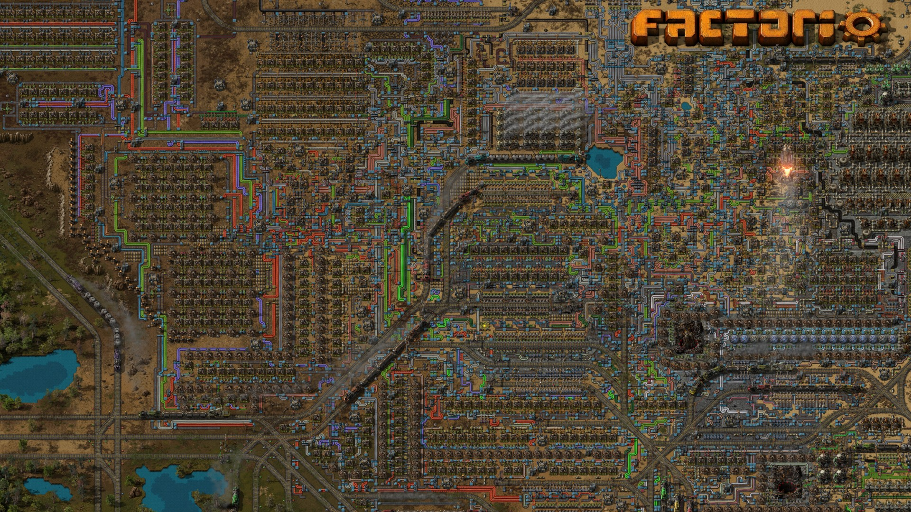

<!-- CC BY-SA Klaus Post https://creativecommons.org/licenses/by-sa/4.0/deed.en -->

<!-- 
theme: gaia
class: 
    - lead
-->

# The Feeling of Fast Code

Klaus Post @ Golab 2023

---

# 💓 Florence

---

# A story...

---

# Our stories are linear

We build our perception from linear events

Cause and Effect

<!-- We arrange them in sequence and learn from cause+effect -->

---

# Parallel Plotlines?

How do you describe a system you are about to build?

<!-- Is it a flowchart? It is a flowchart, right? -->

 ----

# Modern CPUs

A CPU is like a good story. It has several parallel plotlines.

 * Pipelines
 * Branch prediction
 * Out-of-order execution
 * Speculative execution
 * Caching
 * Hyperthreading.

   

---

# 128 concurrent stories?

... all with several parallel plotlines?

<!-- CPU picture... Multiple cores -->

---

# Distributed Systems

* Multiple CPUs
* Multiple nodes
* Remote data
* RPC calls
* Uniformity
* 🤯

---

# The pieces of the puzzle

* More complexity and data than ever
* Sequential execution doesn't get much better
* The only way to scale is to go parallel
* Design is now more important than ever.

---

# v1 first, optimize later

* Gives a linearly designed system
* Limited window for optimizations
* Optimizations start at the top.

---

# How do we start thinking about this?

----
# How to build a race car?

* Performance & Reliability
* Not a solved problem 
* Every decision is a tradeoff
* Money helps, but there is no pay-to-win
* CFD cannot tell you how the car is to drive.

----
# How to build a car?

> **If you get the underlying architecture wrong at the very least you stuck with it for a season.**

*Andrian Newey, F1 podcast*

----

# Building on Faith

Big leaps can require an amount of faith.

* If you think you are more clever than everyone else, you are probably wrong
* ... except like [The Story of the Ferrari 640](https://www.youtube.com/watch?v=QBCwNINnAYY)
* You can't always test big changes before the system is complete
* Convince your most pessimistic colleague
* Be clear about risks and rewards.

---

# Racing Lessons

* You can *always* go faster
* Architecture sets the asymptotic limit
* Testing must correlate with reality.

---
# How to think about speed?

---

# Speeding up...

* Most speedups are specializations
* Speedups seem obvious afterward - creativity
* Focus on proven bottlenecks
* Allocations.

---

# Truly separate work

* Simplify single-thread bound work
* Longest part gives wall speed
* "Lockless" is rarely so
* Sharding breaks single threaded performance
* Experiment with division of work
* Buffers or low latency?

---

# Get out of your comfort zone

* Think concurrent
* Consider points that will serialize your code
* Follow the code
* Limit your indexing.

---

# Use the tools you have

* Benchmarks `go test -bench=X`
* Profilers  `go tool pprof`
* Tracing `go tool trace`
* Disassembler `go build -gcflags=-S`
* Bounds checks `-gcflags="-d=ssa/check_bce/debug=1"`
* Escape analysis `-gcflags="-m -l"`
* Inlining `-gcflags="-m=2"`

Learn to understand the output of these tools.

---

# Myths & Legends

* Branches are slow
* Atomics checks all CPUs
* Fewer instructions are faster
* Memory always go to cache
* Your CPU is incredible (no matter ISA)

---

# Test (your assumptions)

* Always test your assumptions
* Benchmarks should correlate with real use
* Benchmarks should be reproducible
* Microbenchmarks are often misleading.

---

# Build your dreams

* Keep an open mind
* Feels like a puzzle
* Remember it is a SKILL that builds with PRACTICE.

---

# Q & A

---

# Thank You!

Klaus Post @ Golab 2023

`𝕏: @sh0dan`

